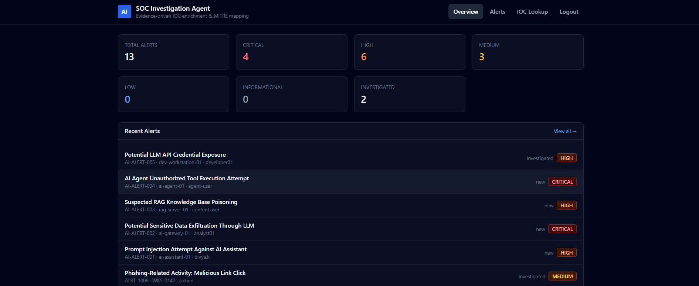
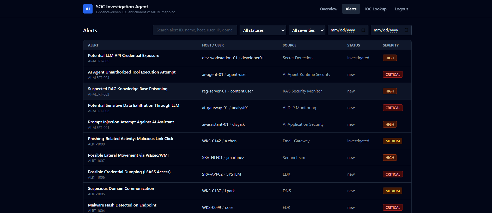
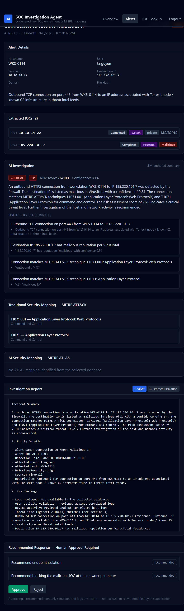
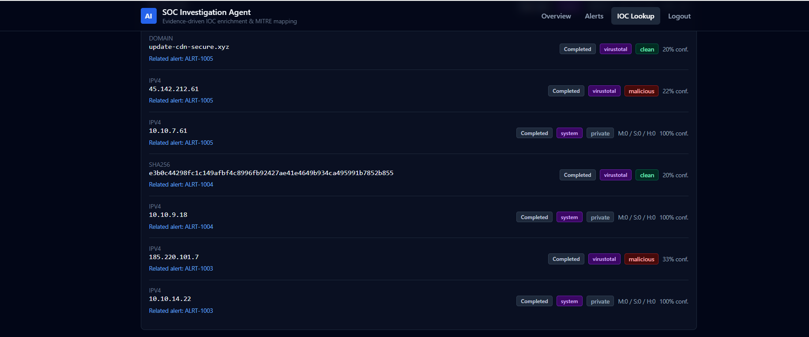

# 🛡️ AI-Powered SOC Investigation Agent

An end-to-end **AI-assisted Security Operations Center (SOC) investigation platform** that automates evidence collection, IOC enrichment, MITRE ATT&CK / ATLAS mapping, deterministic risk analysis, and AI-assisted investigation reporting.

The project demonstrates how **AI agents can support SOC analysts while keeping security decisions grounded in collected evidence**.

---

## 🚀 Live Demo

### Application

https://ai-soc-investigation-agent.onrender.com

### API Documentation / Swagger

https://ai-soc-investigation-agent.onrender.com/docs


# 📸 Application Screenshots

## SOC Dashboard

The dashboard provides an overview of alerts and SOC investigation activity.



---

## Security Alerts

The Alerts page displays security incidents available for investigation.



---

## AI Investigation

The investigation view displays alert evidence, IOC enrichment, AI-assisted findings, risk analysis, MITRE mappings, and recommended response actions.



---

## IOC Lookup

The IOC Lookup feature allows analysts to investigate indicators and review available threat-intelligence enrichment.



---

# 🔎 Investigation Workflow

```text
Security / AI Alert
        ↓
SOC Investigation Agent
        ↓
Evidence Collection
 ├── Alert Context
 ├── Log Correlation
 ├── IOC Extraction
 └── Threat Intelligence Enrichment
        ↓
MITRE ATT&CK + MITRE ATLAS Mapping
        ↓
Deterministic Risk Analysis
        ↓
Groq LLM
        ↓
AI Investigation Summary
        ↓
Analyst Investigation Report
        ↓
Recommended Response
        ↓
Human Review / Approval
```

The LLM is used to analyze and summarize collected evidence.

IOC reputation, MITRE mappings, risk analysis, and other security evidence are collected or calculated outside the LLM so that the model does not become the source of truth for security decisions.

---

# ✨ Key Features

## 🤖 AI-Assisted SOC Investigation

The investigation agent can:

- Process security alerts
- Collect investigation evidence
- Correlate relevant logs
- Extract indicators of compromise
- Enrich IOCs using threat intelligence
- Map activity to MITRE ATT&CK
- Map AI-related threats to MITRE ATLAS
- Perform deterministic risk analysis
- Generate AI-assisted investigation summaries
- Produce recommended response actions

Groq is used as the LLM provider for AI-assisted investigation.

Structured LLM output is validated before it is used by the application.

If AI generation fails, the investigation workflow can fall back to deterministic analysis instead of failing the entire investigation.

---

## 🔍 IOC Extraction & Threat Intelligence

The agent can extract indicators including:

- IPv4 / IPv6 addresses
- SHA256 hashes
- SHA1 hashes
- MD5 hashes
- Domains
- URLs
- Email indicators

External threat-intelligence enrichment supports providers such as:

- VirusTotal
- AbuseIPDB

When enrichment data is unavailable, the application reports only the available evidence rather than inventing missing information.

---

# 🧠 MITRE ATT&CK & MITRE ATLAS

The investigation workflow supports both traditional cybersecurity incidents and AI-security incidents.

## MITRE ATT&CK

Used for mapping traditional cybersecurity activity and attacker techniques.

## MITRE ATLAS

Used for mapping threats involving AI and machine-learning systems.

This allows the platform to demonstrate investigation of both **traditional SOC incidents** and **AI-security incidents**.

---

# 🧪 AI Security Incident Scenarios

The sample alert dataset includes several AI-security scenarios.

## Prompt Injection

Attempts to manipulate an AI assistant through malicious instructions.

## Sensitive Data Exfiltration Through LLM

Potential attempts to expose confidential information using an LLM.

## RAG Knowledge Base Poisoning

Suspicious modifications that could influence information retrieved by an AI system.

## Unauthorized AI Agent Tool Execution

Attempts to make an AI agent execute unauthorized tools or actions.

## LLM API Credential Exposure

Potential exposure of credentials associated with an LLM service.

---

# 📊 Deterministic Risk Analysis

The project does not rely solely on an LLM to determine security risk.

The deterministic analysis layer evaluates collected evidence such as:

- Alert context
- IOC reputation
- Log evidence
- MITRE mappings
- Investigation findings

The AI layer then helps explain the collected evidence in an analyst-friendly format.

This architecture keeps security classification grounded in collected evidence instead of relying entirely on generative AI.

---

# 📄 Investigation Reports

The platform generates analyst-oriented reports containing:

- Incident summary
- Entity details
- Key findings
- IOC / threat-intelligence findings
- MITRE ATT&CK mappings
- MITRE ATLAS mappings
- Risk assessment
- AI-assisted investigation summary
- Recommended response actions
- Additional investigation details

Two report views are available:

### Analyst Report

Designed for SOC analysts and technical investigation.

### Customer Escalation Report

Provides an escalation-oriented view that can be used when communicating investigation results.

---

# 🔐 Authentication & Account Security

The application includes an authentication and account-recovery workflow.

Features include:

- Email-based registration
- Email + password login
- Secure password hashing
- JWT authentication
- Protected SOC API endpoints
- Forgot-password workflow
- Email OTP verification
- OTP expiration
- Password reset

Password-reset OTP emails in the hosted application are delivered using **Resend**.

Sensitive credentials remain in backend environment variables and are not exposed to the React frontend.

---

# 👨‍💻 Human-in-the-Loop Response

The platform intentionally avoids automatically executing destructive remediation actions.

Instead, the investigation agent produces recommended response actions that can be reviewed by an analyst.

```text
AI Investigation
       ↓
Recommended Action
       ↓
Human Review
    ↙       ↘
Approve    Reject
```

Approving an action in the demonstration application simulates and records the response rather than modifying a real production system.

This keeps the analyst involved in security-response decisions.

---

# 🏗️ System Architecture

```text
┌─────────────────────────────┐
│       React Frontend        │
│   TypeScript + Tailwind     │
└──────────────┬──────────────┘
               │
               │ REST API
               ▼
┌─────────────────────────────┐
│       FastAPI Backend       │
│                             │
│  Authentication / JWT       │
│  Alert Management           │
│  Investigation APIs         │
│  IOC Services               │
│  Reporting                  │
└──────────────┬──────────────┘
               │
               ▼
┌─────────────────────────────┐
│    Investigation Agent      │
│         LangGraph           │
│                             │
│  Evidence Collection        │
│  IOC Extraction             │
│  Threat Enrichment          │
│  Log Correlation            │
│  ATT&CK / ATLAS Mapping     │
│  Deterministic Risk Engine  │
│  Groq LLM Analysis          │
└──────────────┬──────────────┘
               │
        ┌──────┴─────────┐
        ▼                ▼
┌─────────────┐    ┌──────────────┐
│ PostgreSQL  │    │ Threat Intel │
│             │    │              │
│ Users       │    │ VirusTotal   │
│ Alerts      │    │ AbuseIPDB    │
│ IOCs        │    │              │
│ Incidents   │    └──────────────┘
└─────────────┘
```

---

# 🌐 Production Deployment

The production application uses a **single Render web service**.

```text
                  User
                   │
                   ▼
        ┌─────────────────────┐
        │    Render Service   │
        │                     │
        │  React Frontend     │
        │        +            │
        │  FastAPI Backend    │
        └──────────┬──────────┘
                   │
          ┌────────┼─────────┐
          │        │         │
          ▼        ▼         ▼
     PostgreSQL   Groq    Threat Intel
                          ├─ VirusTotal
                          └─ AbuseIPDB
```text
Application
https://ai-soc-investigation-agent.onrender.com

Swagger
https://ai-soc-investigation-agent.onrender.com/docs
```

---

# 🛠️ Technology Stack

## Backend

- Python
- FastAPI
- SQLAlchemy
- PostgreSQL
- Pydantic
- JWT Authentication

## AI / Agent

- LangGraph
- Groq API
- Structured LLM output validation
- Retrieval-Augmented Generation (RAG)

## Cybersecurity

- IOC Extraction
- VirusTotal
- AbuseIPDB
- MITRE ATT&CK
- MITRE ATLAS
- Deterministic Risk Scoring

## Frontend

- React
- TypeScript
- Vite
- Tailwind CSS
- React Router

## Infrastructure

- Docker
- Docker Compose
- GitHub
- Render
- PostgreSQL
- Resend

---

# 📁 Project Structure

```text
ai-soc-investigation-agent/
│
├── backend/
│   └── app/
│       ├── agents/
│       ├── api/
│       ├── config/
│       ├── database/
│       ├── models/
│       ├── schemas/
│       └── services/
│           ├── enrichment/
│           ├── llm/
│           ├── logs/
│           └── reporting/
│
├── frontend/
│   └── src/
│
├── data/
│   ├── alerts/
│   ├── knowledge_base/
│   └── MITRE datasets
│
├── docs/
│   ├── screenshots/
│   │   ├── dashboard.png
│   │   ├── ai-investigation.png
│   │   ├── investigation-report.png
│   │   └── mitre-mapping.png
│   │
│   ├── ARCHITECTURE.md
│   ├── DATABASE_SCHEMA.md
│   ├── API_DESIGN.md
│   ├── MILESTONES.md
│   └── SENTINEL_INTEGRATION.md
│
├── Dockerfile
├── docker-compose.yml
├── .env.example
└── README.md
```

---

# ⚙️ Running Locally

## 1. Clone the Repository

```bash
git clone https://github.com/Divya2842/ai-soc-investigation-agent.git

cd ai-soc-investigation-agent
```

---

## 2. Configure Environment Variables

Create a local `.env` file based on:

```text
.env.example
```

Configure the services you want to use.

Example:

```env
DATABASE_URL=your_database_url

JWT_SECRET_KEY=your_jwt_secret

GROQ_API_KEY=your_groq_api_key
GROQ_MODEL=openai/gpt-oss-20b

VT_API_KEY=your_virustotal_api_key

ABUSEIPDB_API_KEY=your_abuseipdb_api_key

RESEND_API_KEY=your_resend_api_key
```

---

## 3. Run with Docker Compose

```bash
docker compose up --build
```

Local services:

```text
Frontend
http://localhost:5173

Backend
http://localhost:8000

Swagger
http://localhost:8000/docs
```

---

# 🖥️ Application Navigation

After logging in, the main navigation provides:

```text
Overview
Alerts
IOC Lookup
Logout
```

A typical analyst workflow is:

```text
Overview
   ↓
Alerts
   ↓
Select Incident
   ↓
Alert Details
   ↓
Run AI Investigation
   ↓
Review Findings
   ↓
MITRE ATT&CK / ATLAS Mapping
   ↓
Investigation Report
   ↓
Recommended Response
   ↓
Human Approval / Rejection
   ↓
Back to Alerts
```

---

# 🗄️ PostgreSQL Database

PostgreSQL provides persistent storage for application data including:

- Users
- Alerts
- IOC records
- IOC enrichment
- Investigations
- Response actions
- Password-reset OTP records

The database seeding process is incremental.

Existing alerts are preserved, and only previously unseen alert IDs are inserted.

This allows additional demonstration alerts to be introduced without deleting existing investigation data.

---

# 🔐 Security Design

Several security-focused design decisions are implemented:

- Secrets are supplied using environment variables
- `.env` files are excluded from Git
- Passwords are never stored as plaintext
- Authentication uses JWTs
- Password-reset OTPs expire
- API credentials remain backend-only
- LLM output is validated
- Missing threat intelligence is not fabricated
- Security evidence is collected outside the LLM
- Response actions require human review

---

# 🧠 Evidence-Grounded AI Design

The project follows an **evidence-first investigation architecture**.

```text
Alert
  ↓
Evidence Collection
  ↓
IOC Extraction
  ↓
Threat Intelligence Enrichment
  ↓
Log Correlation
  ↓
MITRE Mapping
  ↓
Deterministic Risk Analysis
  ↓
Groq LLM
  ↓
Analyst-Friendly Explanation
```

The LLM is not used as the sole source for IOC reputation or deterministic security classification.

Instead, evidence is collected first using security services and deterministic logic.

The AI layer then helps explain the collected evidence and produce an analyst-friendly investigation summary.

---

# 🤖 Structured AI Output

AI-generated investigation output is expected to follow a structured schema.

The application validates the LLM response before using it in the investigation.

The expected investigation result includes information such as:

```text
Verdict
Severity
Confidence
Summary
Findings
Evidence
MITRE ATT&CK Techniques
MITRE ATLAS Techniques
Recommended Actions
```

If the generated output cannot be validated, the workflow can fall back to deterministic analysis rather than failing the complete investigation.

---

# 🔄 Incident Investigation Flow

A typical investigation follows this sequence:

```text
1. Security alert received
        ↓
2. Alert context collected
        ↓
3. Indicators extracted
        ↓
4. IOC enrichment performed
        ↓
5. Relevant logs correlated
        ↓
6. MITRE ATT&CK / ATLAS mapped
        ↓
7. Deterministic risk score calculated
        ↓
8. Groq analyzes collected evidence
        ↓
9. Evidence-backed findings generated
        ↓
10. Investigation report generated
        ↓
11. Response actions recommended
        ↓
12. Analyst approves or rejects response
```

---

# 📚 Documentation

Additional project documentation is available in the `docs/` directory.

## Architecture

```text
docs/ARCHITECTURE.md
```

Contains system architecture, investigation workflow, agent design, and service structure.

## Database Schema

```text
docs/DATABASE_SCHEMA.md
```

Contains the application database design.

## API Design

```text
docs/API_DESIGN.md
```

Contains REST API architecture and endpoint documentation.

## Milestones

```text
docs/MILESTONES.md
```

Contains development milestones and implemented functionality.

## Sentinel Integration

```text
docs/SENTINEL_INTEGRATION.md
```

Contains the design for adding Microsoft Sentinel as a future log source.

---

# ⚠️ Current Limitations

- Microsoft Sentinel is not connected to the current live deployment.
- The project currently uses simulated SOC alerts/log data for demonstration.
- External threat-intelligence results depend on provider availability and configured API credentials.
- LLM investigation depends on Groq availability.
- A deterministic investigation path is available when AI generation fails.
- Response actions are recommendations/simulations and are not automatically executed against production infrastructure.
- The project is intended for learning, portfolio demonstration, and AI/SOC security experimentation rather than production SOC deployment.

---

# 🔮 Future Improvements

Potential future enhancements include:

- Microsoft Sentinel integration
- Microsoft Defender integration
- Additional SIEM connectors
- Additional log-source connectors
- Expanded MITRE ATT&CK coverage
- Expanded MITRE ATLAS coverage
- Additional AI-security incident scenarios
- Improved RAG knowledge retrieval
- Investigation timeline visualization
- Analyst feedback loops
- Additional threat-intelligence providers
- Production monitoring and observability

---

# 🎯 Project Goal

The goal of this project is to explore how **AI agents and deterministic cybersecurity engineering can work together in SOC investigation workflows**.

Instead of asking an LLM to independently make security decisions, the platform first collects and analyzes evidence using deterministic security logic.

AI is then used to help analysts interpret that evidence, summarize the investigation, and accelerate the investigation workflow.

---

# 👩‍💻 Author

**Divya K**

Cybersecurity / SOC professional exploring the intersection of:

**SOC Engineering • Security Automation • AI Agents • Generative AI • AI Security**

GitHub:

https://github.com/Divya2842
